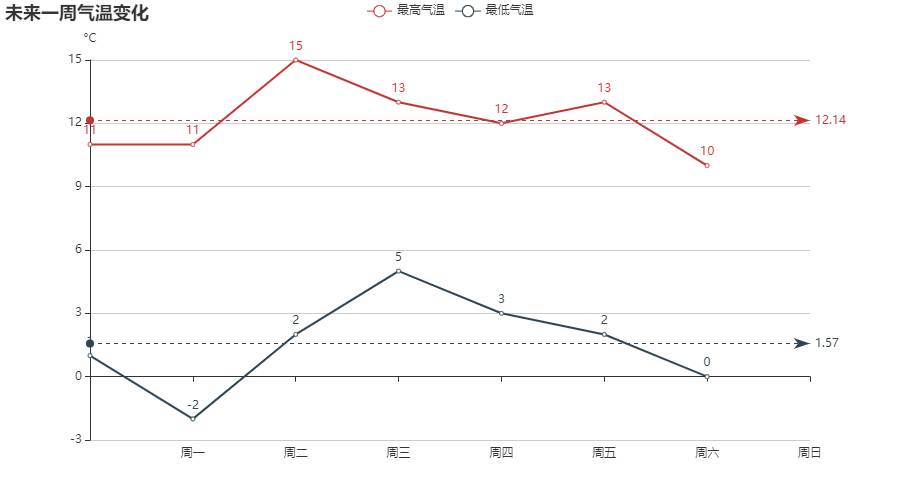

# echarts-line

example

```
go run . -i ./example/data.txt
```

or use bin file

```
echarts-line -i ./example/data.txt
```

input file format: ./example/data.txt

```
1 [page tile]
2 [title]
3 [axis label]
4 [data]
5 ...
```

result:



